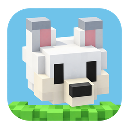
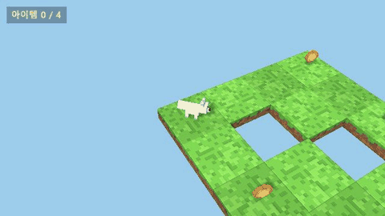
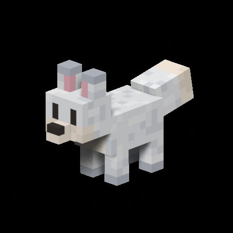
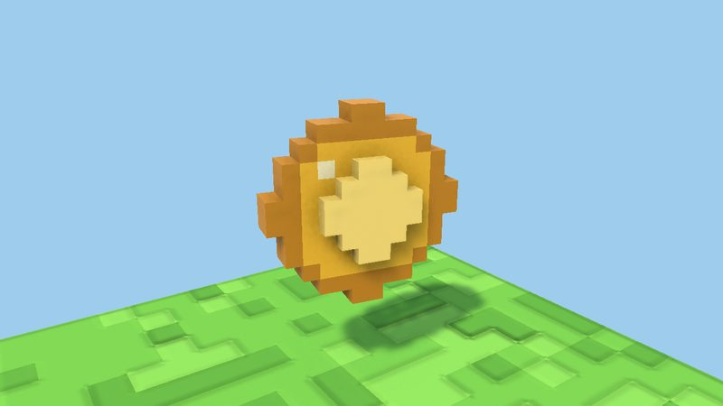
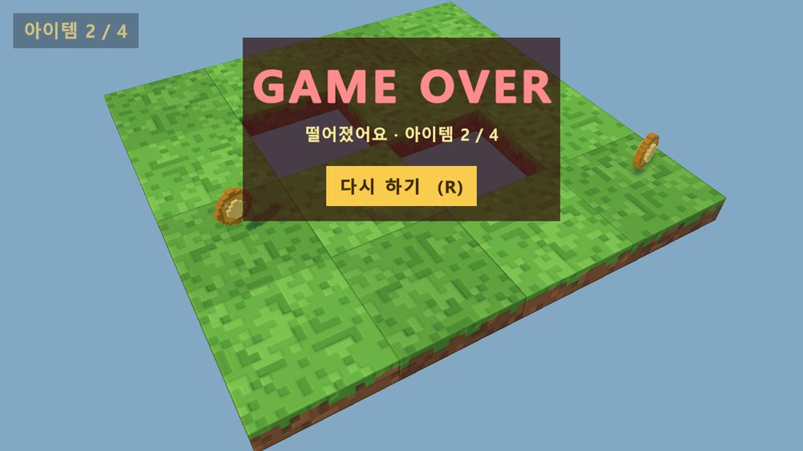
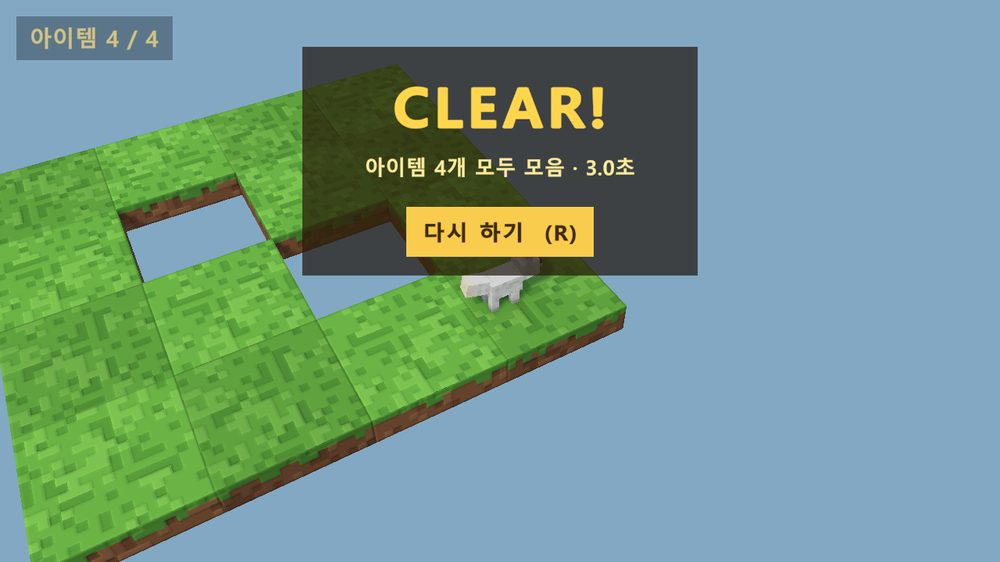

<div align="center">



# VoxelFox

**흰 복셀 여우가 구멍 뚫린 4×4 타일맵에서 코인 4개를 모으는 짧은 3D 게임**


[**🌐 웹 결과 보고서**](https://notard.github.io/voxel-fox/) · [작업 기록](WORKLOG.md) · [결과 보고서](REPORT.md) · [계획서](plan.md) · [체크리스트](TODO.md)



</div>

## 게임 소개

여우를 움직여 맵 위의 코인 4개를 모두 모으면 **CLEAR!**, 구멍이나 맵 밖으로 떨어지면 **GAME OVER**입니다. 결과가 나오면 걸린 시간과 모은 개수를 보여 주고, [다시 하기] 버튼이나 R 키로 처음부터 다시 할 수 있습니다.

| 조작 | 키보드 | 게임패드 |
|---|---|---|
| 이동 | WASD / 방향키 | 왼쪽 스틱 |
| 점프 | Space | A |
| 재시작 | R | Start |

화살표는 타일 격자 방향으로 곧게 움직입니다(↑ 북쪽, → 동쪽). 카메라는 여우를 화면 가운데에 두고 따라가는 쿼터뷰입니다.

| 흰 여우 | 복셀 코인 | GAME OVER | CLEAR! |
|:---:|:---:|:---:|:---:|
|  |  |  |  |

## 특징

- **모든 에셋을 코드로 만듭니다.** 여우 모델·뼈대·동작은 Blender Python 스크립트 하나가, 타일·코인·UI·씬 배치는 Unity 에디터 스크립트가 만듭니다. 값을 바꾸고 다시 실행하면 결과가 그대로 재현됩니다.
- **발이 미끄러지지 않는 걷기.** Walk 동작에서 보폭을 재서 이동 속도에 맞춰 재생 속도를 바꿉니다. 테스트에서 잰 발 미끄러짐은 최대 1.3cm입니다.
- **복셀 입체감.** 잔디 타일은 노멀맵으로 잔디 덩어리의 턱과 둥근 모서리를 표현합니다.
- **문자열로 만드는 맵.** `MapBuilder`의 레이아웃 네 줄(`S` 시작 · `H` 구멍 · `C` 코인 · `.` 타일)만 고치면 맵이 바뀝니다.
- **한글 UI.** 실행할 때 Windows에 설치된 맑은 고딕으로 글꼴을 만듭니다(재배포할 수 없는 글꼴이라 저장소에는 넣지 않았습니다).
- **자동 테스트 62개.** 에셋, 이동, 애니메이션, 코인, GAME OVER / CLEAR, 재시작까지 확인합니다.

## 시작하기

### 필요한 것

- [Unity 6000.5.7f1](https://unity.com/releases/editor/archive) (Windows Build Support 포함)
- [Git LFS](https://git-lfs.com/) — 모델·텍스처·이미지를 LFS로 관리합니다
- [Blender 5.2](https://www.blender.org/) — 여우를 다시 만들 때만 필요합니다
- Git Bash (아래 스크립트용)

```bash
git lfs install
git clone https://github.com/Notard/voxel-fox.git
```

Unity Hub에서 `VoxelFox` 폴더를 열고, 메뉴 **VoxelFox > Play Main Scene**을 누르면 바로 플레이할 수 있습니다.

### 스크립트

| 목적 | 명령 |
|---|---|
| 여우 다시 만들기 (Blender → FBX → Unity 설정 → 미리보기 → 테스트) | `bash tools/build_fox.sh` |
| 씬 조립(맵 → 아이템 → UI) + EditMode·PlayMode 테스트 + 미리보기 | `bash tools/build_map.sh` |
| Windows 실행 파일 빌드 → `VoxelFox/Build/VoxelFox.exe` | `bash tools/build_windows.sh` |
| 체크리스트·작업 기록·보고서 HTML 갱신 | `python tools/make_todo_html.py` |

각 스크립트는 Unity를 배치 모드로 실행하므로, 돌리기 전에 Unity 에디터를 닫아 주세요. `TAG=05 bash tools/build_map.sh`처럼 로그 이름 앞머리를 바꿀 수 있습니다.

## 프로젝트 구조

```
voxel-fox/
├─ Blender/            make_fox.py (복셀 여우 생성), render_preview.py, Fox.blend
├─ VoxelFox/           Unity 프로젝트
│  └─ Assets/
│     ├─ Scripts/      MapBuilder · PlayerController · CameraRig · Collectible · GameManager · GameUI
│     ├─ Editor/       FoxSetup · MapSetup · ItemSetup · UISetup · SceneBuild · BuildWindows
│     ├─ Tests/        EditMode 27 · PlayMode 35
│     ├─ Art/          여우 FBX · 타일 텍스처(색·노멀) · 코인 · 아이콘
│     └─ Prefabs/      Fox · Player · GrassTile · Coin · CoinBurst
├─ tools/              빌드·테스트 스크립트, 문서 HTML 생성기
├─ preview/            단계별 미리보기 이미지·녹화 프레임
├─ docs/               웹 결과 보고서 (GitHub Pages)
└─ logs/               단계별 테스트 결과 (*_results.xml)
```

## 개발 과정

계획서를 8단계로 나눠 진행했고, 플레이해 보며 나온 의견은 하위 단계로 고친 뒤 이유를 기록했습니다.

| 단계 | 내용 |
|---|---|
| 1 | Unity 프로젝트, Git 저장소(LFS) |
| 2 · 2-1 | Blender Python 복셀 여우 → 흰 여우 · 0.9배 |
| 3 · 3-1 | 4×4 타일맵 + 이동 → 바닥 노멀맵 |
| 4 · 4-1 · 4-3 | 애니메이션 연결 → 카메라 추적 · 격자 방향 이동 → 점프 거리 2.08m → 2.68m |
| 5 | 복셀 코인 · 한글 카운터 |
| 6 | GAME OVER / CLEAR! |
| 7 | 재시작 (버튼 · R 키) |
| 8 | Windows 빌드 · 아이콘 |

단계별 결과, 문제와 해결 방법은 [WORKLOG.md](WORKLOG.md)에, 전체 요약은 [웹 결과 보고서](https://notard.github.io/voxel-fox/)와 [REPORT.md](REPORT.md)에 있습니다.

## 만든 도구

- 코드·에셋 생성·테스트·문서: [Claude Code](https://claude.com/claude-code)
- 실행 파일 아이콘: OpenAI Codex CLI의 이미지 생성
- 문장 다듬기: [Humanize KR](https://github.com/epoko77-ai/im-not-ai)
